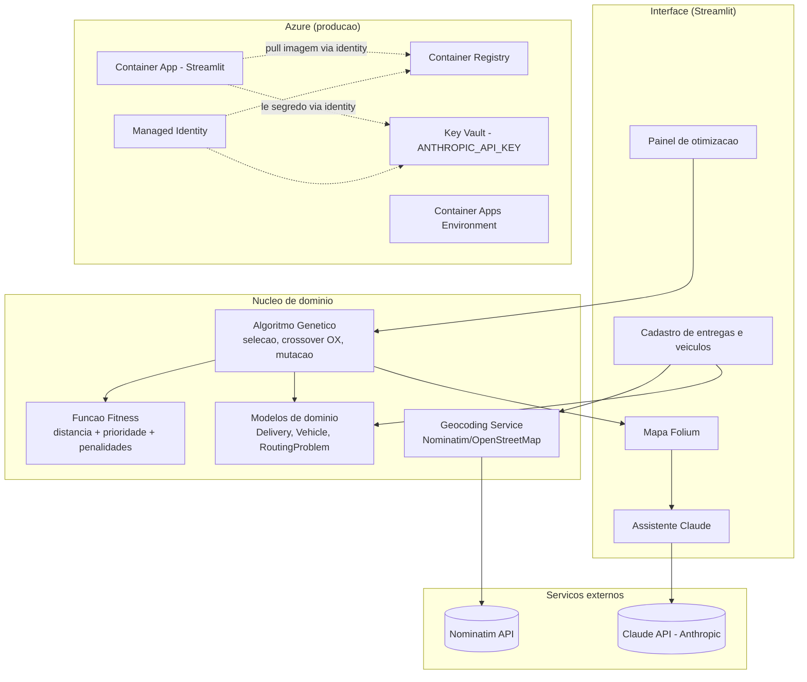

# MedRoutes

Sistema de otimizacao de rotas para distribuicao de medicamentos e insumos, desenvolvido como Tech Challenge da Fase 2 da pos-graduacao em IA para Devs (FIAP) — **Projeto 2: Otimizacao de Rotas para Distribuicao de Medicamentos e Insumos**.

O sistema cadastra entregas e veiculos, otimiza as rotas com um **Algoritmo Genetico implementado do zero**, visualiza o resultado em um mapa interativo e usa a **API da Anthropic (Claude)** para gerar instrucoes para motoristas, relatorios de eficiencia e respostas a perguntas em linguagem natural sobre as rotas.

## Indice

- [Visao geral](#visao-geral)
- [Arquitetura](#arquitetura)
- [Stack tecnologica](#stack-tecnologica)
- [Estrutura do projeto](#estrutura-do-projeto)
- [Como executar localmente](#como-executar-localmente)
- [Algoritmo Genetico: decisoes tecnicas](#algoritmo-genetico-decisoes-tecnicas)
- [Experimentos comparativos](#experimentos-comparativos)
- [Integracao com Claude](#integracao-com-claude)
- [Testes automatizados](#testes-automatizados)
- [Deploy no Azure](#deploy-no-azure)
- [Limitacoes conhecidas](#limitacoes-conhecidas)

## Visao geral

Um centro de distribuicao precisa entregar medicamentos criticos e insumos regulares para diversos enderecos, usando uma frota limitada de veiculos com capacidade de carga e autonomia maximas. O MedRoutes resolve esse problema de roteamento de veiculos (VRP - *Vehicle Routing Problem*) priorizando entregas criticas, respeitando restricoes de capacidade/autonomia, e minimizando a distancia total percorrida.

Fluxo de uso (via interface Streamlit):

1. Definir o endereco do deposito (origem/retorno de todas as rotas).
2. Cadastrar entregas (endereco, tipo — medicamento critico ou insumo regular, peso/volume).
3. Configurar a frota (numero de veiculos, capacidade de carga, autonomia maxima).
4. Rodar o Algoritmo Genetico e visualizar as rotas otimizadas no mapa.
5. Usar o assistente Claude para gerar instrucoes por motorista, relatorio de eficiencia, ou perguntar sobre as rotas em linguagem natural.

## Arquitetura



### Representacao do problema (VRP) escolhida pelo Algoritmo Genetico

O cromossomo e um **"giant tour"**: uma permutacao com os indices de *todas* as entregas, sem marcar explicitamente a separacao entre veiculos. A decodificacao (`decode_chromosome`) percorre essa permutacao e distribui as entregas entre os veiculos disponiveis respeitando a capacidade de carga, abrindo o proximo veiculo quando o atual nao comporta mais peso.

Essa escolha foi deliberada: permite reutilizar operadores classicos de permutacao (Order Crossover, mutacao por inversao) sem precisar inventar operadores especificos para multiplas rotas, mantendo a implementacao simples e correta.

## Stack tecnologica

| Camada | Tecnologia |
|---|---|
| Interface | Streamlit |
| Visualizacao de mapas | Folium + streamlit-folium |
| Geocodificacao | Nominatim (OpenStreetMap), via geopy |
| Otimizacao | Algoritmo Genetico implementado do zero (sem DEAP ou similares) |
| IA generativa | Claude API (`claude-sonnet-4-6`), via SDK `anthropic` |
| Gerenciamento de dependencias | Poetry |
| Testes | pytest + pytest-mock |
| Containerizacao | Docker |
| Infraestrutura como codigo | Bicep |
| Cloud | Azure Container Apps, Azure Container Registry, Azure Key Vault |
| CI/CD | GitHub Actions |

## Estrutura do projeto

```
medroutes/
├── app/
│   ├── main.py                 # Streamlit entry point
│   ├── geocoding.py             # Geocodificacao via Nominatim
│   ├── genetic/
│   │   ├── algorithm.py         # Loop principal do AG (GeneticAlgorithm)
│   │   ├── operators.py         # Selecao por torneio, crossover OX, mutacao por inversao
│   │   └── fitness.py           # Decodificacao de cromossomo + funcao fitness
│   ├── llm/
│   │   └── claude_client.py     # Integracao com a API da Anthropic
│   ├── maps/
│   │   └── route_map.py         # Construcao do mapa Folium
│   └── models/
│       └── delivery.py          # Dataclasses: Delivery, Vehicle, DepotLocation, RoutingProblem
├── experiments/
│   ├── run_experiments.py       # Script de comparacao de configuracoes do AG
│   └── results/                 # CSV e grafico de convergencia gerados
├── infra/
│   ├── main.bicep               # Entry point (escopo subscription)
│   ├── resources.bicep          # Recursos do Resource Group
│   ├── parameters.json          # Parametros de deploy
│   └── deploy.sh                # Script de deploy (build, push, update)
├── tests/                        # Suite pytest (35 testes)
├── .github/workflows/deploy.yml # Pipeline CI/CD
├── Dockerfile
├── pyproject.toml
└── .env.example
```

## Como executar localmente

### Pre-requisitos

- Python 3.10+
- [Poetry](https://python-poetry.org/)

### Passos

```bash
cd medroutes

# instalar dependencias
poetry install

# copiar e preencher variaveis de ambiente
cp .env.example .env
# editar .env e definir ANTHROPIC_API_KEY (opcional, so necessario para os
# recursos de IA generativa)

# rodar a aplicacao Streamlit
poetry run streamlit run app/main.py
```

A aplicacao abre em `http://localhost:8501`. Cadastre o deposito, entregas e veiculos na barra lateral, depois clique em "Otimizar rotas".

### Rodando os testes

```bash
poetry run pytest tests/ -v
```

### Rodando os experimentos comparativos

```bash
poetry run python experiments/run_experiments.py
```

Gera `experiments/results/comparison.csv` e `experiments/results/convergence.png`.

## Algoritmo Genetico: decisoes tecnicas

Implementado integralmente do zero em `app/genetic/`, sem bibliotecas de AG (DEAP ou similares), conforme exigido pelo desafio.

### Representacao cromossomica

Permutacao de indices das entregas (giant tour), decodificada em rotas multiplas por um algoritmo greedy que respeita a capacidade de cada veiculo (`app/genetic/fitness.py::decode_chromosome`).

### Operadores (`app/genetic/operators.py`)

- **Selecao por torneio** (`tournament_selection`): sorteia N individuos e seleciona o de menor fitness. O tamanho do torneio controla a pressao seletiva.
- **Crossover OX — Order Crossover** (`order_crossover`): copia um segmento contiguo de um pai para o filho preservando posicoes, e completa as posicoes restantes com os genes do outro pai na ordem em que aparecem, garantindo uma permutacao valida (sem repeticoes ou omissoes).
- **Mutacao por inversao** (`inversion_mutation`): inverte um subtrecho aleatorio do cromossomo com probabilidade `mutation_rate`, preservando a validade da permutacao.
- **Elitismo**: os `elitism_count` melhores individuos de cada geracao sao preservados integralmente na proxima geracao (`app/genetic/algorithm.py`), garantindo que o melhor fitness nunca piore entre geracoes.

### Funcao fitness (`app/genetic/fitness.py::evaluate_fitness`)

Fitness = combinacao ponderada de quatro termos (menor valor = melhor solucao):

1. **Distancia total** percorrida pela frota (Haversine entre paradas consecutivas, incluindo ida e volta ao deposito).
2. **Prioridade de entregas criticas**: penaliza entregas de medicamento critico posicionadas tarde em sua rota (posicao normalizada x peso de prioridade do tipo), incentivando o AG a entrega-las primeiro.
3. **Penalidade de capacidade**: kg excedentes acima da capacidade do veiculo, multiplicados por um peso alto (1000 por padrao), criando forte pressao seletiva contra solucoes invalidas.
4. **Penalidade de autonomia**: km excedentes acima do alcance maximo do veiculo, com a mesma logica de penalizacao.

Os pesos sao configuraveis via `FitnessWeights`, permitindo ajustar a importancia relativa de cada termo sem alterar o codigo do AG.

## Experimentos comparativos

Foram executadas 4 configuracoes do AG sobre o mesmo cenario sintetico (25 entregas, 4 veiculos, 120 geracoes), variando tamanho de populacao, taxa de mutacao e tamanho do torneio:

| Configuracao | Populacao | Mutacao | Torneio | Fitness final | Distancia (km) | Tempo (s) | Geracao do melhor |
|---|---|---|---|---|---|---|---|
| A - pop. pequena, mutacao baixa | 30 | 0.05 | 3 | 5490.37 | 305.71 | 0.47 | 115 |
| B - pop. grande, mutacao baixa | 150 | 0.05 | 3 | 358.64 | 265.13 | 2.25 | 82 |
| C - pop. media, mutacao alta | 80 | 0.40 | 3 | **322.75** | 234.41 | 1.23 | 87 |
| D - pop. media, mutacao baixa, torneio maior | 80 | 0.10 | 6 | 330.84 | 241.44 | 1.62 | 90 |

**Conclusoes:**

- A Config A (populacao pequena + mutacao baixa) ficou muito atras das demais — populacao pequena limita a diversidade genetica inicial, e mutacao baixa nao compensa essa falta de diversidade, fazendo o AG convergir prematuramente para um otimo local ruim (fitness ~17x pior que as outras configuracoes).
- A Config C (populacao media + mutacao alta) obteve o melhor resultado, sugerindo que, para este cenario, uma taxa de mutacao mais agressiva (0.40) ajuda a escapar de otimos locais sem exigir uma populacao tao grande quanto a Config B.
- A Config B (populacao grande) chega perto do melhor resultado mas com o maior custo computacional (quase 2x o tempo da Config C), mostrando que aumentar a populacao tem retornos decrescentes quando a taxa de mutacao ja e baixa.
- Reproduza os experimentos com `poetry run python experiments/run_experiments.py` (resultados salvos em `experiments/results/`).

## Integracao com Claude

`app/llm/claude_client.py` encapsula todas as chamadas ao SDK `anthropic`, isolando o restante da aplicacao da API (facilita mock em testes e troca de modelo). Tres funcionalidades:

1. **Instrucoes por motorista** (`generate_driver_instructions`): gera, em portugues, a ordem das paradas, alertas para itens criticos, e lembrete de retorno ao deposito.
2. **Relatorio de eficiencia** (`generate_efficiency_report`): compara a distancia da rota otimizada com uma rota aleatoria (baseline), reportando economia em km e %.
3. **Perguntas em linguagem natural** (`answer_question_about_routes`): responde perguntas como "qual entrega e mais urgente?" ou "qual veiculo esta mais sobrecarregado?", com base nos dados reais das rotas otimizadas.

A `ANTHROPIC_API_KEY` e lida exclusivamente de variavel de ambiente (`.env` local ou Key Vault em produção) — nunca hardcoded no codigo.

## Testes automatizados

35 testes pytest cobrindo:

- `tests/test_fitness.py` — distancia Haversine, decodificacao de cromossomo, funcao fitness (capacidade, prioridade).
- `tests/test_operators.py` — selecao por torneio, crossover OX (validade da permutacao), mutacao por inversao.
- `tests/test_algorithm.py` — execucao completa do AG, monotonicidade do fitness com elitismo.
- `tests/test_models.py` — validacoes das dataclasses de dominio.
- `tests/test_geocoding.py` — servico de geocodificacao com mock do Nominatim (sem chamadas reais de rede).
- `tests/test_claude_client.py` — integracao com a Claude API, sempre mockada (sem custo ou dependencia de rede nos testes).

```bash
poetry run pytest tests/ -v
```

## Deploy no Azure

Infraestrutura definida em Bicep (`infra/`), seguindo boas praticas de seguranca do Azure:

- **Sem chaves/admin no ACR**: autenticacao via Managed Identity com role `AcrPull`.
- **Key Vault com RBAC habilitado e purge protection ativado**: guarda a `ANTHROPIC_API_KEY`; o Container App le o segredo via Managed Identity (role `Key Vault Secrets User`), nunca em texto plano.
- **Container Apps Environment** com logs encaminhados para Log Analytics.

Recursos criados: Resource Group, Container Registry, Managed Identity, Key Vault, Log Analytics Workspace, Container Apps Environment, Container App.

### Deploy manual

```bash
az login
ANTHROPIC_API_KEY=sk-ant-xxx ./infra/deploy.sh
```

O script valida a infraestrutura com `az deployment sub what-if` antes de aplicar, builda e publica a imagem Docker no ACR, e atualiza o Container App.

### Deploy via GitHub Actions

`.github/workflows/deploy.yml` roda os testes pytest e, em caso de sucesso (push em `main`), aplica a infraestrutura e atualiza a imagem via OIDC (sem secrets de longa duracao). Requer os secrets do repositorio: `AZURE_CLIENT_ID`, `AZURE_TENANT_ID`, `AZURE_SUBSCRIPTION_ID`, `ANTHROPIC_API_KEY`.

## Limitacoes conhecidas

- A geocodificacao via Nominatim e gratuita mas tem limite de ~1 requisicao/segundo; cadastrar muitas entregas de uma vez pode ser lento.
- A decodificacao do cromossomo usa uma heuristica greedy (nao um split otimo via programacao dinamica); funciona bem na pratica mas nao garante a melhor distribuicao possivel entre veiculos para cada permutacao.
- O calculo de distancia usa Haversine (linha reta), nao distancia rodoviaria real — adequado para o escopo do desafio, mas nao reflete trafego ou trajeto real de ruas.
